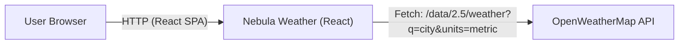

# Nebula Weather

A clean, responsive weather search UI powered by the **OpenWeatherMap Current Weather API**.  
Built with React (Create React App) and designed to be lightweight, readable, and recruiter-friendly.

## Features

- Search weather by city name (e.g., *Toronto*, *Tehran*, *Vancouver*)
- Loading + error states (handles missing API key and API errors)
- Displays key metrics: temperature, feels-like, humidity, pressure, wind, visibility, clouds, coordinates
- Accessible UI (labels, aria regions) + minimal test coverage
- GitHub Actions CI for tests

## Tech Stack

- **React** (Create React App)
- **Fetch API** for network requests
- **OpenWeatherMap API**
- **Testing Library** (Jest + React Testing Library)
- **GitHub Actions** (CI)

## Architecture



## Getting Started

### 1) Create an OpenWeather API key
Create a free API key on OpenWeatherMap, then add it to a local env file.

### 2) Configure environment variables

Create **`.env.local`** in the project root:

```bash
REACT_APP_OPENWEATHER_KEY=your_openweather_api_key_here
```

A template is included as `.env.example`.

### 3) Install & run

```bash
npm install
npm start
```

Open `http://localhost:3000`.

## Scripts

- `npm start` — run dev server
- `npm run build` — production build
- `npm test` — interactive test runner
- `npm run test:ci` — CI mode tests (no watch)

## Testing

```bash
npm run test:ci
```

## Notes

- This project intentionally keeps the UI simple and transparent (no complex state libraries) to keep code review-friendly.
- For production hardening, add request cancellation, caching, and rate-limit handling.

## Roadmap

- Unit toggle (°C/°F)
- Debounced search (optional)
- Persist last searched city in `localStorage`
